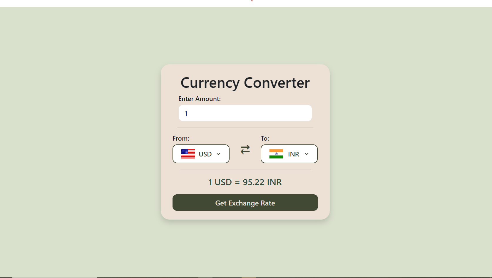
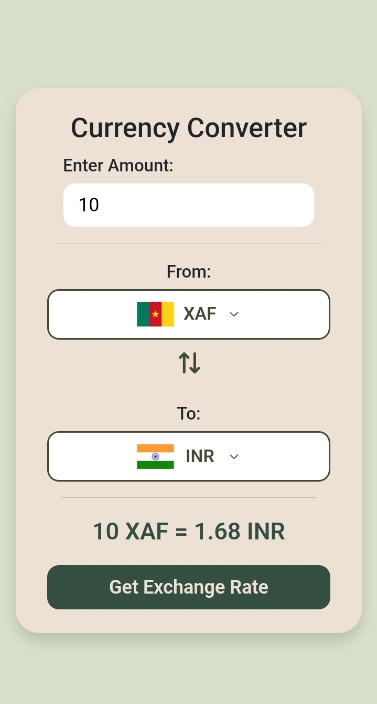

# 💱 Currency Converter App

A beautiful, simple, and responsive web app that lets you convert money amounts between different world currencies using live exchange rates.

## 🔗 Live Demo
[👉 Click here to try it out live!](https://bharti2761.github.io/currency-converter/)

## ⭐ Features
* **Live Calculations:** Gets real-time, accurate exchange values instantly.
* **Country Flags:** The country flag automatically changes when you pick a new currency from the list.
* **Responsive Design:** It looks perfect on huge desktop monitors and scales down beautifully to fit tiny smartphone screens.
* **Clean UI:** Easy to read, featuring soft earthy colors and modern rounded borders.

## 🛠️ Built With
* **HTML5:** For the layout structure.
* **Bootstrap 5 & CSS3:** For making the design mobile-responsive and pretty.
* **JavaScript:** For fetching live data and making the app actually calculate things.
* **FontAwesome:** For the arrows icon in the center.

## 📸 How it Looks

### Desktop Layout

### Mobile Layout

## 💻 How to Run it on Your Computer
1. Download or clone this project.
2. Open the `index.html` file in any browser (like Chrome, Edge, or Safari).
3. Start converting!
